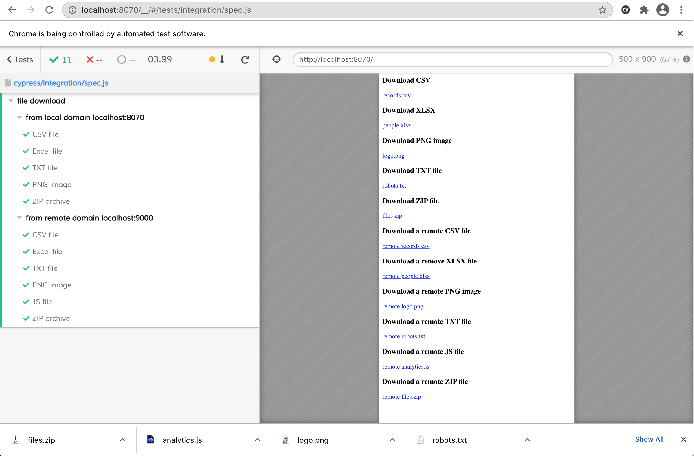

# Download and validate a file

- a CSV file
- an Excel file
- a PNG image
- a TXT file
- a JS file
- a Zip file
- a PDF file

Spec file | Description
---|---
[form-submission-spec.js](./cypress/integration/form-submission-spec.js) | Intercepts and verifies a file downloaded after a form submission
[local-download-spec.js](./cypress/integration/local-download-spec.js) | Downloads files from local domain by using `<a href=... download>` anchor links
[location-href-spec.js](./cypress/integration/location-href-spec.js) | Intercepts and verifies a file downloaded via setting `document.location.href=...` URL
[remote-download-spec.js](./cypress/integration/remote-download-spec.js) | Downloads files from another domain by using `<a href=... download>` anchor links

## Notes

Text files are validated right from the browser spec, but the binary files like the downloaded Zip archives need to be validated from Node code using the plugins file, see [cypress/plugins/index.js](cypress/plugins/index.js)

The spec also shows how to "catch" form submission that downloads a file using [cy.intercept()](https://on.cypress.io/intercept). After intercepting the request and redirecting back at the test, the test shows how to request the file and validate it.

The spec shows how to call a task to find the downloaded file using a wildcard mask. This is useful if you do not know the exact filename beforehand.
